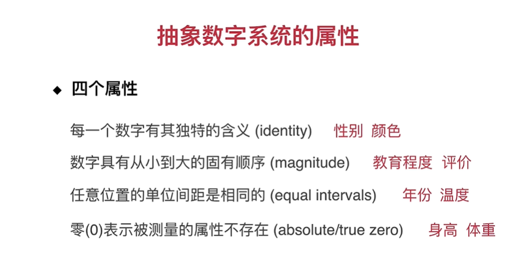
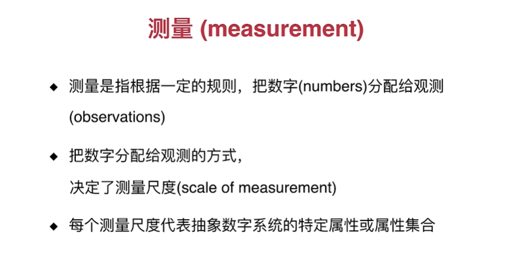
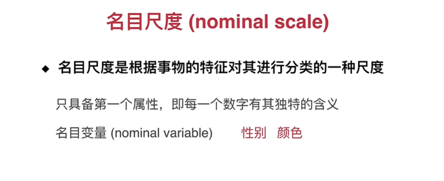
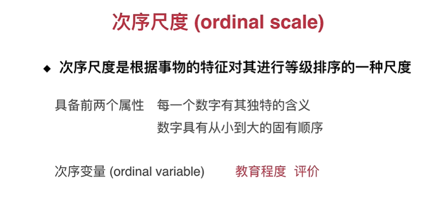
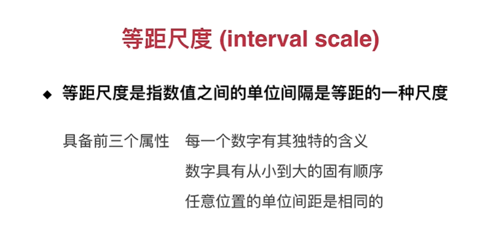
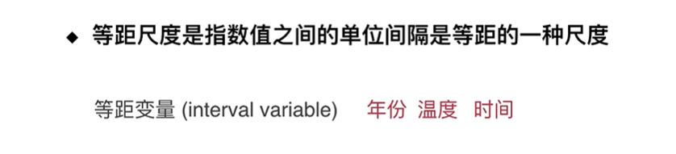
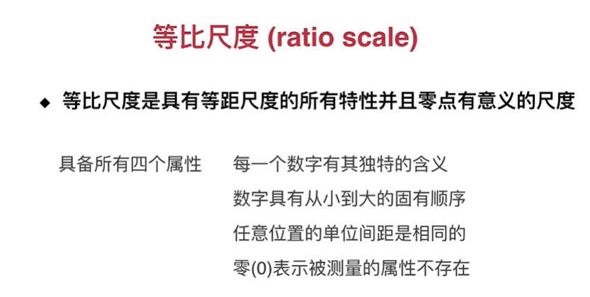
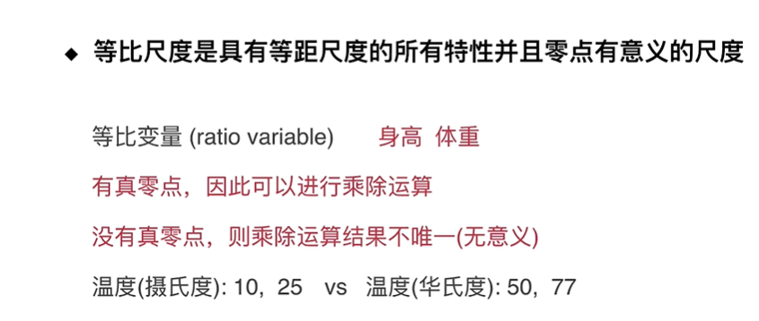
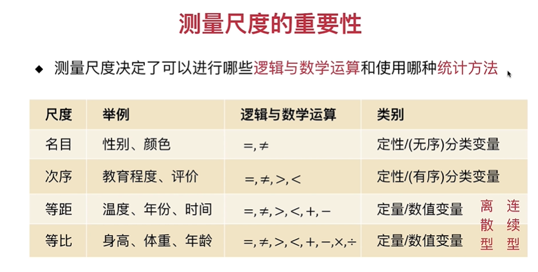
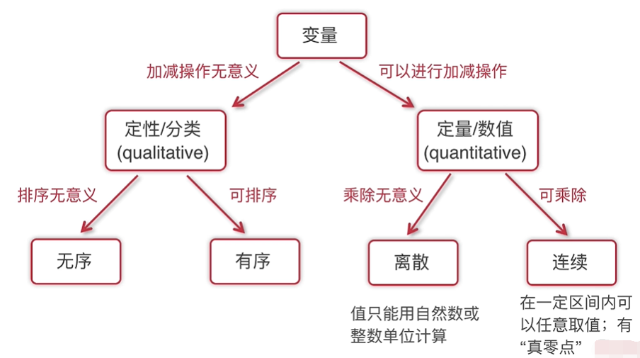

# 测量尺度

为什么要把变量划分的如此细致？

那就要谈一下测量尺度的概念

测量不同的东西需要不同的“尺子”，测量时间需要手表，测量血压需要血压仪。

## 抽象数字系统的属性

体重等于 0 或者 身高等于 0 都说明这个属性不存在

## 测量

## 第 1 把尺子：名目尺度 

名目变量的俗名叫作：无序分类变量

## 第 2 把尺子：次序尺度

 次序变量的俗名叫作：有序分类变量

note:教育程度和评价是在次序尺度这把尺子的测量下得到的

## 第 3 把尺子：等距尺度

等距变量

## 第 4 把尺子：等比尺度

在摄氏度的测量下 25 是 10 的 2.5 倍，但是在华氏度的测量下 77 不是 50 的 2.5 倍，也就是 0 点的选定是相对的，因此没有真零点，乘除运算结果不唯一，没有意义。

我的思考：零点的选定是相对的，如果摄氏度的零点改为旧的摄氏度参考系下的 -5 摄氏度为零点，那么这就是另外一个结果。

## 测量尺度的重要性

变量的类别是由其背后的测量尺度决定的，

变量实在哪个尺度上得到的，这决定了这个变量可是执行哪些数学逻辑运算以及可以使用哪些统计方法进行分析：

## 判断一个变量所属尺度

这个判断过程有点像决策树：

